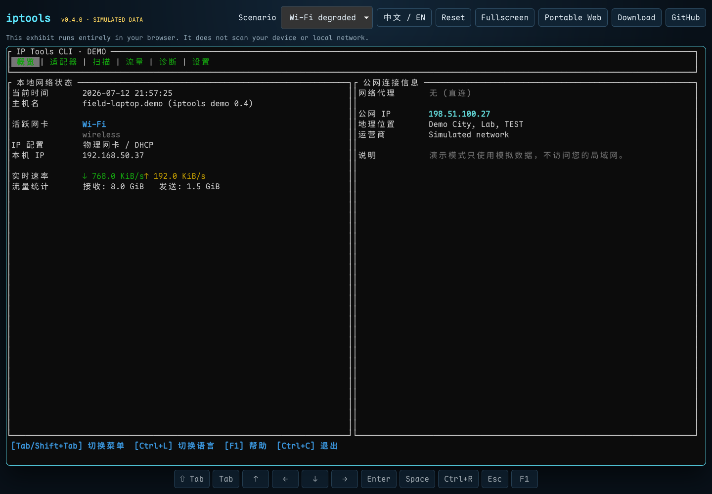

# iptools

[English](README.en.md) · 简体中文

跨平台的网络管理与诊断终端工具。一个界面集中查看网卡、配置 IP、发现局域网设备、监控流量，并运行常用网络诊断。

[](https://github.com/newcovid/iptools/actions/workflows/ci.yml)
[](https://github.com/newcovid/iptools/releases/latest)
[](#平台支持)
[](LICENSE)

[在线体验](https://newcovid.github.io/iptools/) · [下载最新版](https://github.com/newcovid/iptools/releases/latest) · [问题反馈](https://github.com/newcovid/iptools/issues)



> 在线版使用确定性的模拟数据，不读取本机网络、不扫描局域网，也不修改系统配置。它与原生版共用界面、状态机和交互逻辑，首次加载后可离线使用。

## 功能

| 页面 | 能力 |
|---|---|
| 概览 | 主机、活动网卡、本地地址、DHCP、代理、实时/累计流量和公网连接信息 |
| 适配器 | 查看物理/虚拟网卡、IPv4/IPv6、MAC、SSID 和链路；配置 DHCP 或静态 IPv4 |
| 扫描 | 按 CIDR 执行局域网 ARP 发现，显示 IP、MAC、厂商和主机名 |
| 流量 | 按网卡查看实时收发速率、本次会话和开机累计流量 |
| 诊断 | Ping、路由跟踪、端口扫描、公网测速、链路质量和 TCP/UDP 内网测速 |
| 设置 | 切换中英文、扫描并发数和配色方案，清除已保存参数 |

主要特性：

- 键盘与鼠标完整操作，输入历史支持 `Ctrl+R`、方向键补全和鼠标选择；
- 中文与英文界面，内置 Classic、Nord、Catppuccin Mocha 和 Dracula 配色；
- 单文件原生程序，无需额外运行时；
- 参数、历史和界面位置自动保存，配置文件采用原子写入；
- Windows 与 Linux 原生网络后端，后台任务可取消并在退出前可靠回收；
- WebAssembly 演示支持 DOM/Canvas、触控按键、PWA 离线和同源资源策略。

## 安装

### 下载发行版

从 [Releases](https://github.com/newcovid/iptools/releases/latest) 下载对应平台的压缩包：

- Windows：运行 `iptools-*-windows-x86_64.exe`；
- Linux：解压 `iptools-*-linux-x86_64.tar.gz`，运行 `./iptools`。

部分功能需要系统权限：

- Windows 修改 IP 配置时需要管理员权限；
- Linux 的 ARP、ICMP 和路由探测需要 root 或 `CAP_NET_RAW`，发行包内的 `install.sh` 可授予最小能力；
- Linux 无线详情依赖 `iw`，网络配置写入依赖 PolicyKit、`sudo` 及系统可用的 `nmcli`、`netplan` 或 `ip`。

### 从源码构建

需要 Rust 1.97.0。仓库已固定工具链，并使用 rustls，无需 OpenSSL 开发包。

```bash
git clone https://github.com/newcovid/iptools.git
cd iptools
cargo build --release
```

产物位于 `target/release/iptools`；Windows 下为 `target/release/iptools.exe`。

## 使用

```text
iptools
iptools --config /path/to/config.json
iptools --demo
iptools --demo --scenario wifi-degraded
iptools --version
```

默认配置文件为当前目录的 `config.json`。完整字段见 [`config.example.json`](config.example.json)。`session` 保存输入参数、最近历史和界面位置，通常不需要手工修改。

### 默认快捷键

| 操作 | 按键 |
|---|---|
| 切换页面 | `Tab` / `Shift+Tab` |
| 导航 | 方向键或 `W` `A` `S` `D` |
| 确认 / 返回 | `Enter` / `Esc` |
| 编辑 | `E` |
| 开始 / 停止 | `Space` |
| 刷新 | `R` |
| 输入历史 | `Ctrl+R` |
| 切换语言 | `Ctrl+L` |
| 帮助 | `F1` |
| 退出 | `Ctrl+C` / `Ctrl+Q` |

底部帮助栏显示当前上下文和实际绑定，并可直接点击。原生版快捷键可在配置文件的 `keybindings` 中重绑。

## 平台支持

| 功能 | Windows | Linux | 其它 Unix |
|---|:---:|:---:|:---:|
| 端口扫描、公网/内网测速 | ✓ | ✓ | ✓ |
| 网卡枚举、ARP 扫描 | ✓ | ✓ `CAP_NET_RAW` | — |
| Ping、路由跟踪、链路质量 | ✓ | ✓ `CAP_NET_RAW` | 有限 |
| 无线详情 | WLAN API | `iw` | — |
| IP 配置写入 | WMI | `nmcli` / `netplan` / `ip` | — |

局域网扫描基于 ARP，只能可靠发现同一二层网络中的在线设备。写入网络配置可能短暂中断连接，请先确认目标网卡和参数。

## 在线演示

[WebAssembly 演示](https://newcovid.github.io/iptools/)包含 `home-network`、`wifi-degraded` 和 `multi-adapter` 三种场景。浏览器端只加载同源静态资源，无遥测和真实网络请求；适配器编辑只产生模拟结果。

URL 可指定：

```text
?scenario=wifi-degraded&lang=zh&renderer=dom
```

支持 `scenario`、`lang` 和 `renderer=dom|canvas`。URL 参数优先于浏览器本地设置。

## 开发

```bash
cargo fmt --all -- --check
cargo clippy --workspace --all-targets -- -D warnings
cargo test --workspace
cargo build --release
cargo check -p iptools-web --target wasm32-unknown-unknown
```

Web 本地运行：

```bash
cd crates/iptools-web
trunk serve
```

进一步资料：

- [架构说明](docs/architecture.md)
- [链路质量评测指南](docs/link-quality-guide.md)
- [更新记录](CHANGELOG.md)
- [贡献指南](CONTRIBUTING.md)
- [安全策略](SECURITY.md)

## 许可证

[MIT](LICENSE) © newcovid
